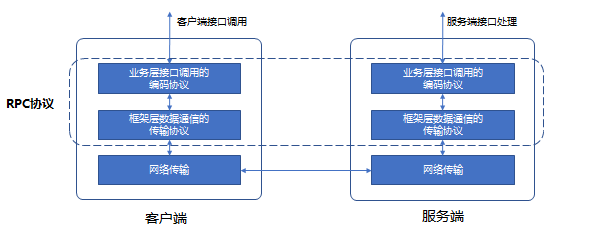

# 前言

如何更好与异构的系统互通互联, 成为tRPC在设计和实现时核心要解决的问题. 为了这个问题, 框架在设计和实现上必须保持开放性和具备高可扩展性的能力, 因此tRPC在架构设计上采用插件化设计思想. 

本文首先会简单介绍一下tRPC插件化采用的具体技术, 然后再整体讲一下tRPC插件化的架构设计是怎样的. 希望通过本文的介绍, 希望大家能对tRPC设计理念/整体架构有一个初步的认识, 为后续tRPC服务开发, 插件使用和开发, 协议开发, 以及拦截器的开发和使用, 做必要的知识储备.

# 插件化设计的关键技术

框架在插件化实现的总体设计原则如下:
1. 只定义插件标准接口;
2. 不做具体实现, 与任何平台/系统解耦;
3. 对接具体平台/系统, 开发适配的具体插件即可;

具体实现上, 则采用了基于接口机制的插件工厂和基于AOP思想的拦截器.

## 插件工厂

tRPC把框架内部的功能和特性抽象成一个个独立的插件, 然后框架负责这些独立插件的串联和拼装, 来实现框架所要支持的功能和特性. 而这些独立的插件内部实现上, 则定义统一的插件抽象接口, 具体插件需要实现定义的抽象接口, 然后把具体插件注册到插件工厂里, 由插件工厂实例化插件.

例如: 框架对多协议的支持, 定义了统一的Codec, 不同协议只需要按照Codec接口即可实现即可.

例如: 框架对接不同名字服务系统, 定义了统一的Registry/Selector, 对接不同的名字服务系统时只需要按照Registry/Selector接口即可实现即可.

通过插件工厂的设计, 可以带来以下的好处:
- 对于框架侧: 框架只定义标准接口，没有任何插件实现，与平台/系统完全解耦;

- 对于平台/系统侧: 只需要按照框架插件标准接口即可实现插件, 即可将系统/平台的能力融入到框架中;

- 对于用户侧: 业务开发只需要通过配置进行使用, 对用户透明;

## 拦截器

为了使框架有更强的可扩展性, 框架支持了拦截器filter, 它借鉴了java面向切面(AOP)的编程思想. 

具体的实现方式是通过在框架请求处理流程中设置埋点逻辑, 然后通过在埋点地方插入一系列的filter, 来实现一些业务个性化的功能, 比如：metrics监控、日志收集、链路跟踪、过载保护、参数校验、日志回放、故障注入等.

拦截器filter工作流程如下图:

拦截器的最终目的是让业务逻辑与框架进行解耦, 并允许各自进行内聚性开发, 可以在不修改框架代码的情况下, 给业务程序动态添加或替换业务个性化的功能.

# 插件化架构

有了上面插件化的关键技术支持, 接下来看看tRPC插件化架构是怎样设计的.

## 总体架构设计

总体架构如下:

总体架构由"**框架核心**"和"**插件**"两部分组成. 如上图所示, 虚线框内为tRPC, 其中中间的红色实线框为框架核心, 蓝色框为插件部分.

其中框架核心又可以分三层:

- **通信层**: 负责数据的传输和协议的编解码, 框架内置支持tcp/udp等通信协议, 传输协议采用基于protobuf的tRPC协议来承载RPC调用, 支持通过codec插件来使用其它传输协议

- **服务治理层**: 负责将服务治理功能抽象成插件组件, 采用插件化架构, 通过调用插件和外部服务治理系统完成对接, 实现服务发现、负载均衡、监控、调用链等服务治理功能

- **调用层**: 封装服务和服务代理实体, 提供RPC调用接口, 支持业务用同步、异步、单向以及流式调用等方式进行服务间调用

此外框架还提供了admin管理接口, 方便用户或者运营平台可以通过调用admin接口对服务进行管理. 管理接口包括更新配置、查看版本、修改日志级别、查看框架运行时信息等功能, 同时框架也支持用户自定义管理接口,以满足业务定制化需求.

插件则是框架核心和外部服务治理组件串联起来的桥梁. 插件一边需要按框架标准接口实现插件, 注册到框架核心, 并完成插件实例化；另一边插件需要调用外部服务治理服务的SDK/API, 实现如服务发现、负载均衡、监控、调用链等服务治理功能.

其中插件按功能大致分为下面几个组件:
- codec: 提供协议编解码相关的接口, 允许通过插件的方式来扩展业务协议、序列化方式、数据压缩方式等协议处理;
- naming：提供了服务注册(registry)、服务发现(selector)、负载均衡(loadbalance)、熔断(circuitbreaker)等能力封装, 用于对接各种名字服务系统;
- config：提供了配置读取相关的接口, 支持读取本地配置文件、远程配置中心配置等，允许插件式扩展支持不同格式的配置文件、不同的配置中心，支持 reload、watch 配置更新;
- metrics：提供了监控上报的能力, 支持常见的单维上报，如 counter、gauge 等, 也支持多维上报, 允许通过扩展 Sink 接口实现对接不同的监控系统;
- logging：提供了通用的日志采集接口, 允许通过插件的方式来扩展日志实现, 输出到远程;
- tracing：提供了分布式跟踪能力，允许通过插件的方式上报到调用链系统;

## 具体架构设计

rpc调用从开发者角度来说, 它可以让你像本地函数调用一样进行跨节点的函数调用, 通常一个完整的RPC过程如下图:

图中描述步骤是一个RPC调用必须要经过的环节. 基于此共性, 我们把框架在横向上分为服务端和客户端, 在纵向进行分层. 其中, 纵向上的服务端大致分为Transport、Codec、Service和Filter层. 客户端分为Transport、Codec、ServiceProxy、Filter层, 具体设计如下图:

在这张图中, 我们新增了一层filter层(拦截器), 其主要目的是采用AOP的思想, 把业务个性化的需求（校验校验、流量回放、故障注入等）、以及服务治理的大部分功能(比如监控指标上报, 调用链跟踪, 远程日志, 鉴权等)以横切关注点的方式, 插入到请求/响应处理的流程中, 通过这样的设计大大的增强了框架的可扩展性. 

同时系统对每一层进行模块化拆分, 采用插件化的实现, 框架通过基于接口编程的思想, 串联rpc调用的全流程. 对于一些模块,框架也采用了更细粒度的模块拆分. 比如selector模块被细分为服务发现、服务路由、负载均衡和熔断等子模块. Codec层也被细分为编解码, 序列化和压缩三个子模块.

通过上面整体的分层设计, 具体模块的插件化实现和细粒度的模块拆分, 使框架具备很强的扩展性和开放性. 业务可以灵活替换插件,实现与不同系统的对接, 也可以进行业务个性化定制能力实现.