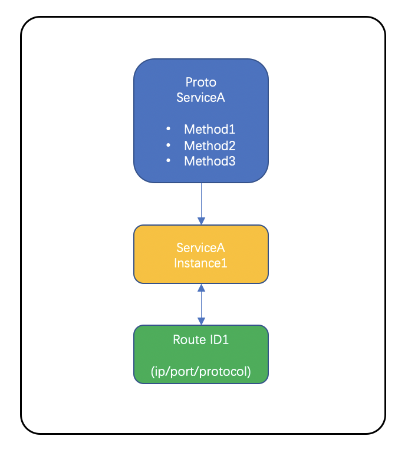
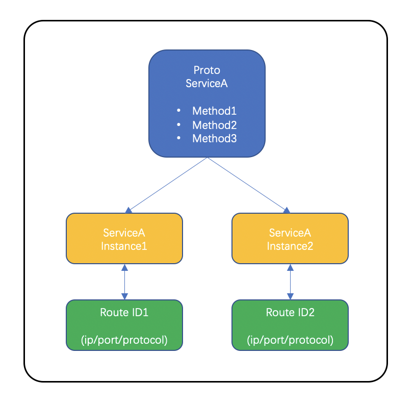
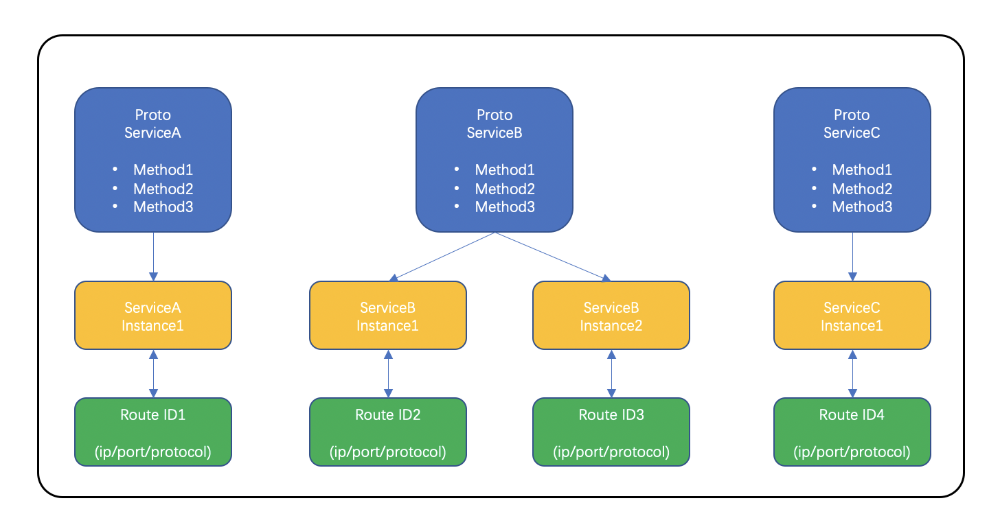

[TOC]

# 前言

本文主要介绍一下tRPC服务的一些术语, 主要涉及到proto接口文件、服务名、服务寻址等方面的命名规则, 方便能在开发tRPC服务时能从整体上对这些概念/命名规则有统一的认识, 避免理解上有误.

# 服务命名

下图是服务A使用rpc调用服务B的流程图:


上面服务A作为客户端, 服务B作为服务端, 在tRPC中我们称客户端也为 `主调(caller)`, 服务端也为 `被调(callee)`.

## 服务路由标识

微服务架构中, 服务之间的调用一般都是使用专门的路由名字间接寻址到被调用者的ip/port来进行访问的, 而不是直接写死ip/port进行访问的. 因此, 服务会先把自身的路由名字会注册到名字服务系统中, 作为这个服务的唯一身份, 方便主调服务进行识别, 这就要求服务自身的命名能在众多微服务中具有唯一性. 同时微服务化后, 系统中会有很多很多的服务, 如何通过服务的一些信息能快速识别这个服务类型, 方便对服务日常的管理和运维, 这也要求对服务的名字有一定的规范.

因此, 为了方便对服务的路由寻址和日常治理, tRPC在服务命名制定了一些规范, 并推荐大家都遵循这个规范, 具体如下:

服务的路由名字由`.`号分割的四段字符串: **"trpc.{app}.{server}.{service}"** 来组成, 各个字段的含义如下:
- 第一段固定为`trpc`, 表示这个服务是一个tRPC服务.
- 第二段为`{app}`, 我们称为应用名. 通常表示实现某个业务系统名称, 用于标识这个业务下不同服务的一个集合, 开发者可以根据需要自己定义.
- 第三段为`{server}`, 我们称为服务的进程名. 一个 `{server}` 必须属于某个 `{app}`, 同一个 `{app}` 下的 `{server}` 名称都具备唯一性. 然后 `{app}.{server}`的组成在全局上要具备唯一性.
- 第四段为`{service}`, 我们称为具体服务提供者, 提供了接口供客户端调用, 这个名字通常命名为proto文件中Service的名字, 我们日常称呼的service即是proto文件的Service. 从网络通信的角度讲, 每个service对应一个IP + 端口 + 协议 + 一系列接口方法.

## 接口标识

在解决了服务寻址后, 接下来我们需要解决被调能根据主调的消息信息能分发到相应rpc方法的问题, 这就要求主调方与被调方在消息通信的协议上对RPC方法的命名有统一的规范.

下面是一个比较简单的服务提供的接口proto文件

```protobuf
syntax = "proto3";

package trpc.test.helloworld;

service Greeter {
  rpc SayHello (HelloRequest) returns (HelloReply) {}
}

message HelloRequest {
   string msg = 1;
}

message HelloReply {
   string msg = 1;
}

```

基于proto文件的用法, tRPC在trpc协议上对RPC调用方法的名字制定了统一的规范, RPC调用方法名由proto文件中的 **"/{package_name}.{service_name}/{method_name}"** 组成. 其中 `{package_name}` 的命名我们建议使用路由名字的前三段 `trpc.{app}.{server}` .

## Service与路由标识的映射

首先, 这里Service指的是proto文件中定义的Service, 它负责定义一系列RPC接口, 而路由标识则是进行服务寻址的名字. 对外提供服务时, 我们需要把两者关联起来, 通过路由标识来找到具体proto的Service提供者.

基于微服务的“单一职责”原则, tRPC建议一个服务端程序只提供一个proto Service, 实例化一个Service实例, 其对应一个路由标识, 使用一种协议和一个port对外提供接口服务。 服务组装模式如图所示:



tRPC也支持一个服务端程序只提供一个proto Service, 实例化多个Service实例, 每个Service实例其对应一个路由标识, 使用一种协议和一个port对外提供接口服务, 不同Service实例的port不能一样。 服务组装模式如图所示:



tRPC也支持一个服务端程序只提供多个proto Service, 不同proto Service可以实例化1个或者多个Service实例, 每个Service实例其对应一个路由标识, 使用一种协议和一个port对外提供接口服务, 不同Service实例的port不能一样。 服务组装模式如图所示:



注意: tRPC不支持同一个端口支持多协议.
