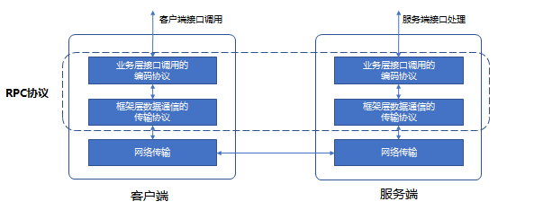

1.RPC

RPC是远端过程调用的简称，其协议通常包含传输协议和编码协议，如下图：

​​
 
其中传输协议指RPC header使用的协议，编码协议指RPC payload的协议。

2.新统一RPC协议设计上应具备的能力和诉求

--------------------|------------------
向前兼容				|协议设计和实现上应具有可扩展性
高性能				|协议的方案选型和具体实现上需要考虑性能问题
RPC调用方式			|远程调用像调本地接口一样
请求超时控制			|请求可以设置超时时间
插件化支持多种编码协议	|协议上支持业务数据的序列化类型应该是多样的，比如protobuf/jce/json/…
支持压缩				|协议上应该支持可选择对业务编码后的数据进行压缩
调用链信息的透传		|协议上应该提供服务调用链信息透传的能力
染色key				|协议上应该提供染色key在服务间透传的能力
认证和鉴权			|协议上应该提供用户设置自定义鉴权信息的能力
透传用户自定义元数据	|协议上应该支持用户设置自定义元数据和透传的能力
流式请求				|协议上应该能解决大数据包传输的问题，和满足边请求边应答的流式场景
...					|


3.新统一RPC协议的具体设计

框架的RPC协议的字段定义如下（保留支持流式的能力，pb使用v3版本）：

```protobuf
syntax = "proto3";

package trpc;

// 请求协议头
message RequestProtocol {
  // 协议版本
  uint32      version                   		= 1; 
  
  // 请求的调用类型
  // 比如: 普通调用，单向调用，流式调用
  uint32      call_type                 		= 2;
  
  // 流id
  uint32    stream_id                   		= 3;
  
  // 请求唯一id
  uint32    request_id                  		= 4;
  
  // 请求的超时时间，单位ms
  uint32    timeout                     		= 5;
  
  // 主调服务的名称
  string    caller                      		= 6;
  
  // 被调服务的路由名称
  // 规范格式，trpc.应用名.服务名.pb的service名
  string    callee                      		= 7;
  
  // 调用服务的接口名
  // 规范格式，pb idl定义的接口名
  string    func                        		= 8;
  
  // 框架信息透传的消息类型
  // 比如调用链、染色key、灰度、鉴权、流结束、多环境等的标识
  uint32    message_type                		= 9;
  
  // 框架透传的信息key-value对，目前分两部分
  // 1是框架层要透传的信息，key的名字要以trpc_开头
  // 2是业务层要透传的信息，业务可以自行设置，严禁key的名称开头使用trpc
  map<string, string> trans_info        		= 10;
  
  // 请求数据的数据类型
  // 比如: proto/jce/json, 默认proto
  uint32    content_type                		= 11;
  
  // 请求数据使用的压缩方式
  // 比如: gzip/snappy/..., 默认不使用
  uint32    content_encoding            		= 12;
  
  // 二进制数据
  repeated  bytes data                  		= 99;
}

// 响应协议头
message ResponseProtocol {
  // 协议版本
  uint32      version                   		= 1; 
  
  // 请求的调用类型
  // 比如: 普通调用，单向调用，流式调用
  uint32      call_type                 		= 2;
  
  // 流式id
  uint32    stream_id  			        		= 3;
  
  // 请求唯一id
  uint32    request_id                 	 		= 4;
  
  // 请求在框架层的错误返回码
  int32    ret                          		= 5;
  
  // 接口的错误返回码
  // 建议业务在使用时，标识成功和失败，0代表成功，其它代表失败
  int32    func_ret                     		= 6;
  
  // 调用结果信息描述
  // 失败的时候用
  string    error_msg                   		= 7;
  
  // 框架信息透传的消息类型
  // 比如调用链、染色key、灰度、鉴权、流结束、多环境等的标识
  uint32    message_type                		= 8;
  
  // 框架透传回来的信息key-value对，
  // 目前分两部分
  // 1是框架层透传回来的信息，key的名字要以trpc_开头
  // 2是业务层透传回来的信息，业务可以自行设置，严禁key的名称开头使用trpc
  map<string, string> trans_info        		= 9;
  
  // 响应数据的编码类型
  // 比如: proto/jce/json, 默认proto
  uint32    content_type                		= 10;
  
  // 响应数据使用的压缩方式
  // 比如: gzip/snappy/..., 默认不使用
  uint32    content_encoding            		= 11;
  
  // 二进制数据
  repeated  bytes data                  		= 99;
}
```

另外，请求和响应协议的前面加两个固定长度的头：魔数和长度。魔数在前，长度在后，其中魔数字段占4个字节，估计为0x22E09（其10进制数142857称走马灯数），长度字段占4个字节，内容为消息结构体RequestProtocol或者ResponseProtocol序列化后的大小。