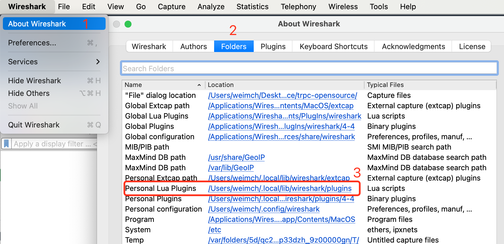
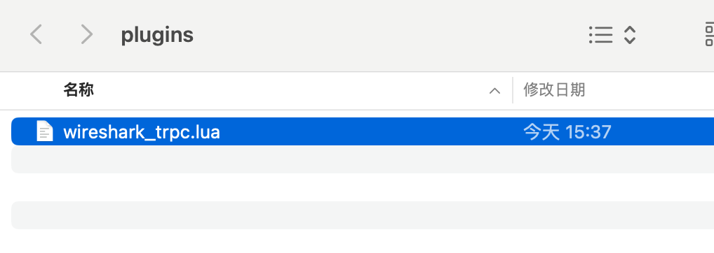
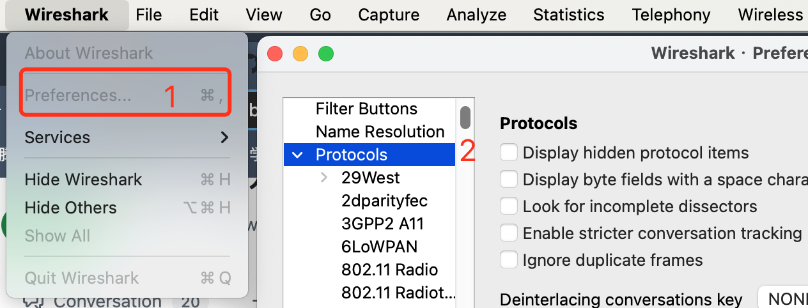
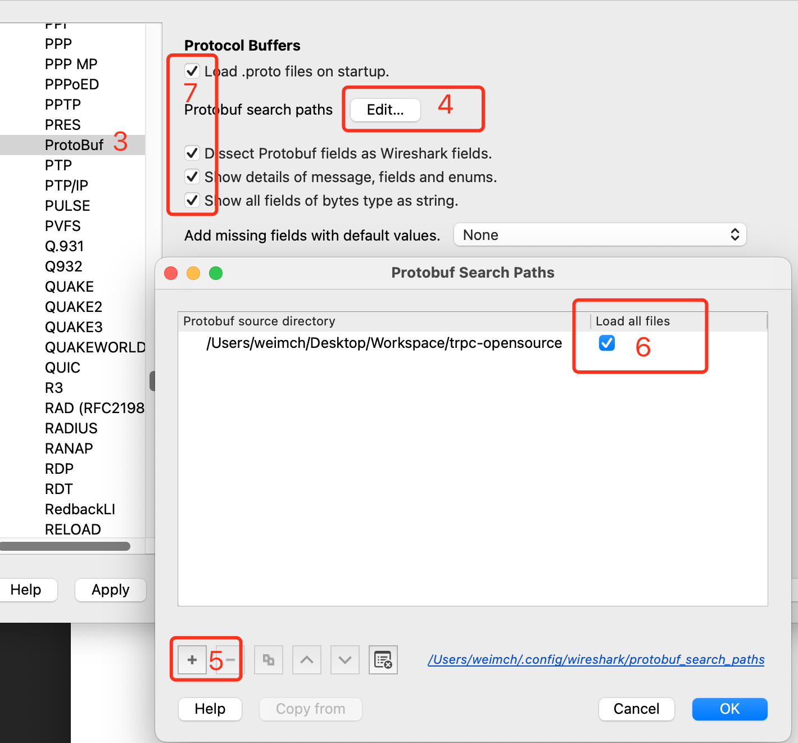
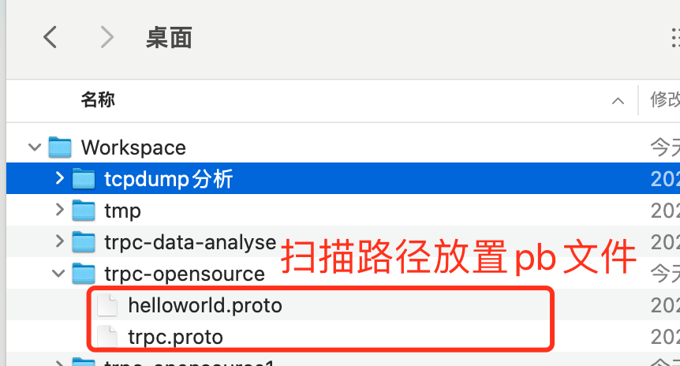
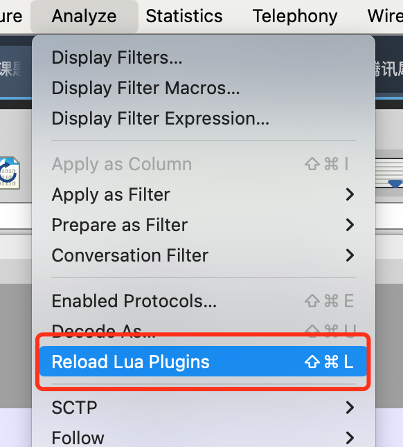
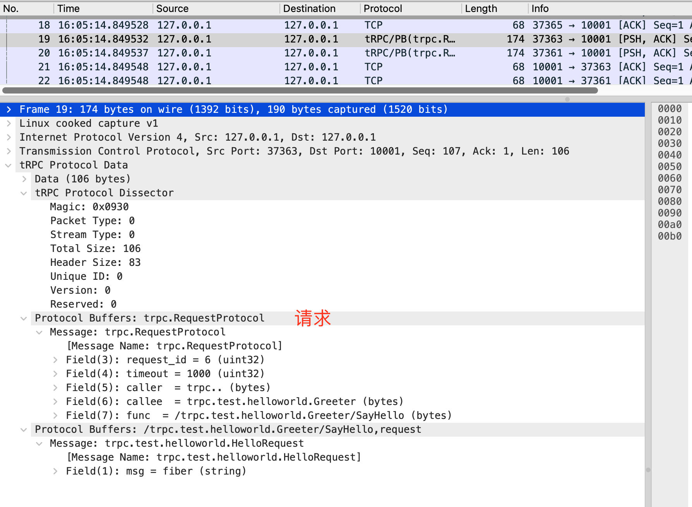
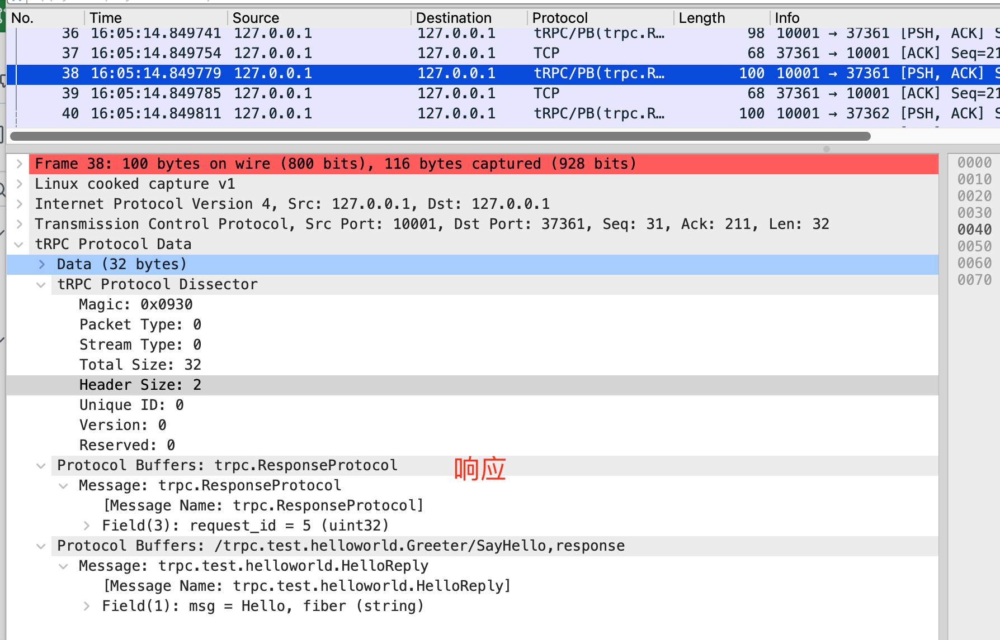
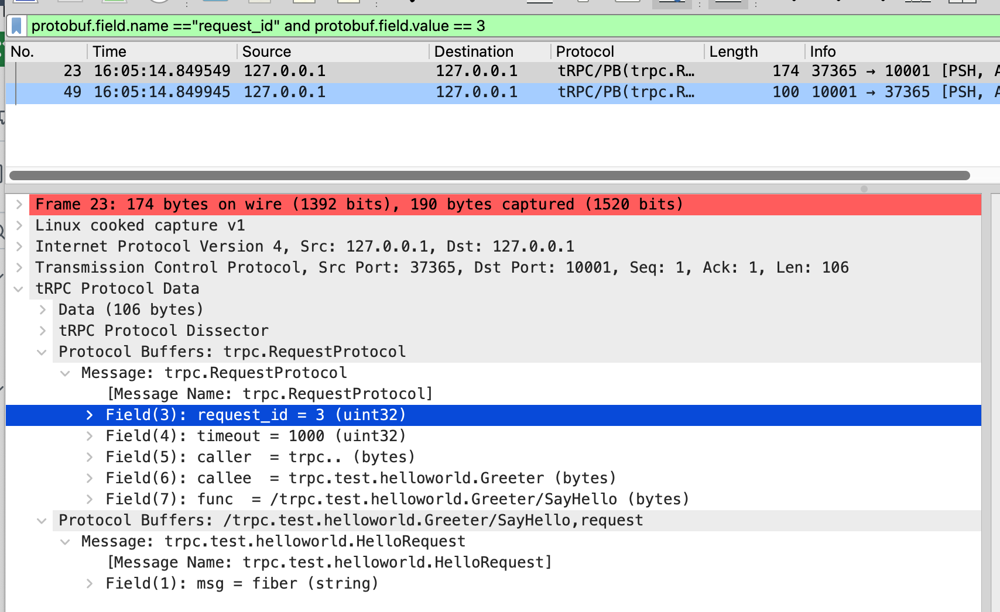
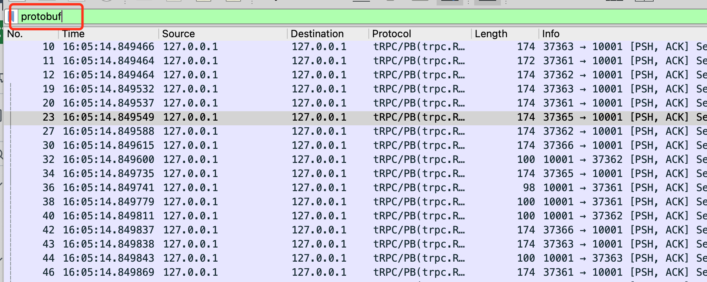

# tRPC Wireshark解析器

## 前言

`tool/wireshark_trpc.lua` 是 tRPC 协议的 Wireshark 解析器，提供了对 tRPC 协议头、业务 pb 的解析能力。

当前使用有如下限制：

1. 暂不支持解析tRPC流式协议；
2. 暂不支持attachment；
3. 暂不支持UDP；
4. 不支持解析开启压缩后的pb数据（业务pb数据会被压缩）；

## 用法

### tcpdump抓包

执行下面的tcpdump抓包

```bash
# 10001 替换为服务端端口
tcpdump -iany port 10001 -w trpc_packet.pcap
```

**注意：** 有时可能因为机器环境问题，导致tcpdump抓包被截断，比如只抓了请求包的部分，wireshark使用lua脚本解析会失败，这时可以抓包时使用 `-s xxx` 防止截断，代表调整低于xxx字节的packet不截断。

### Wireshark配置

1. 从选项卡 `About Wireshark` -> `Floders` 查看 `Personal Lua Plugins` 的目录。



2. 进入 `Personal Lua Plugins` 目录，放入 [wireshark_trpc.lua](../../tool/wireshark_trpc.lua)。



3. 设置proto扫描文件目录，并开启基于protobuf的解析。

- 此文件目录下需要放置 [trpc.proto](../../trpc/trpc.proto)以及业务pb，比如此处我们使用 tRPC-Cpp 示例的 [helloworld.proto](https://github.com/trpc-group/trpc-cpp/blob/main/examples/helloworld/helloworld.proto)。
- 需要勾选 `Load .proto files on startup.`、`Dissect Protobuf fields as Wireshark fields.`、`Show details of message, fields and enums.`、`Show all fields of bytes type as string.` 以通过protobuf解析器来解析字段。

  

  

  

### Wireshark加载tcpdump抓包

加载包之后，如果没有看到 `Protocol` 显示 `tRPC`，需要强制加载下lua脚本。



如果都成功，能看如下图所示tRPC协议以及业务pb都被正常解析了。





### 筛选指定请求和响应

有时会发现并发很多个请求，可能有某几个请求会调用失败，为了进一步排查，需要更多tRPC协议/业务pb字段等信息，这时候可以通过 protobuf 字段来筛选出指定请求/响应。

Wireshark 支持通过 protobuf 字段做筛选，业务可以选择使用trpc协议头的 request_id 或者业务 pb 某个字段做匹配来查看指定请求和响应的交互情况。

下面是根据trpc协议头的 `requet_id=3` 筛选指定请求和响应的示例，大家可根据自身情况指定筛选条件。

```text
protobuf.field.name == "request_id" and protobuf.field.value == 3
```



### 忽略tcp的控制帧

我们更多的会关注协议包的交互情况，而不关注tcp控制帧（tcp握手/挥手等），这时可以通过设置下面的筛选条件清除tcp控制帧的显示。

```text
protobuf
```


